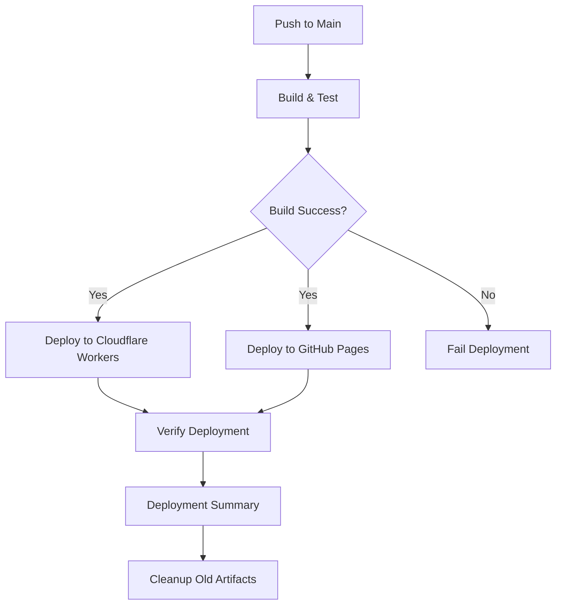
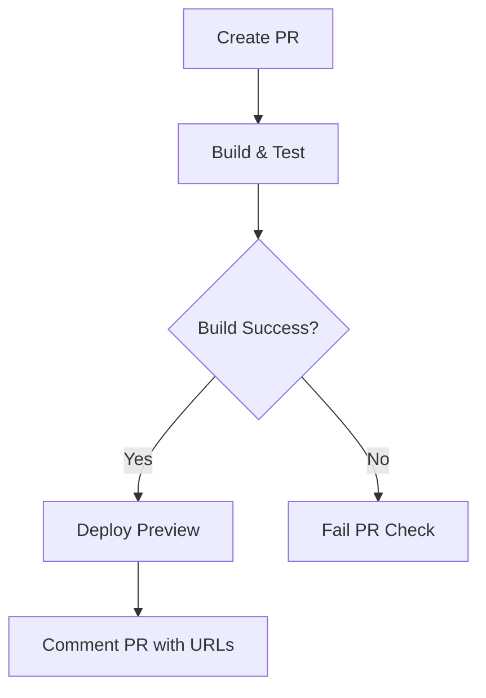

# 🚀 Enhanced Unified Deployment Guide

## Overview

The BaddBeatz project now uses an **Enhanced Unified Deployment** system that combines the best features of both Cloudflare Workers and GitHub Pages deployment strategies. This provides redundancy, better testing, and multiple deployment targets.

## 🏗️ Architecture

### Deployment Targets
1. **Primary: Cloudflare Workers** → `https://baddbeatz.nl`
2. **Secondary: GitHub Pages** → `https://crzyhax91.github.io/baddbeatz`
3. **Preview: Development Environment** → `https://baddbeatz-dev.workers.dev`

### Workflow Structure
```
┌─────────────────┐
│   Push to Main  │
└─────────┬───────┘
          │
    ┌─────▼─────┐
    │Build & Test│
    └─────┬─────┘
          │
    ┌─────▼─────┐
    │  Parallel │
    │Deployments│
    └─────┬─────┘
          │
    ┌─────▼─────┐    ┌─────────────┐
    │Cloudflare │    │GitHub Pages │
    │ Workers   │    │             │
    └───────────┘    └─────────────┘
```

## 📋 Workflow Jobs

### 1. Build and Test (`build-and-test`)
- **Purpose**: Validates code, runs tests, builds assets
- **Outputs**: Build artifacts, test results
- **Key Steps**:
  - Install dependencies
  - Run linting and tests
  - Build production assets
  - Validate critical files
  - Security scanning
  - Upload artifacts

### 2. GitHub Pages Deployment (`deploy-github-pages`)
- **Trigger**: Main branch push + successful build
- **Purpose**: Deploy to GitHub Pages as backup/mirror
- **Features**:
  - Static site generation
  - Automatic fallback index.html creation
  - GitHub Pages configuration

### 3. Cloudflare Workers Deployment (`deploy-cloudflare-workers`)
- **Trigger**: Main branch push + successful build
- **Purpose**: Deploy to production Cloudflare Workers
- **Features**:
  - Wrangler configuration validation
  - Production environment deployment
  - Domain verification (baddbeatz.nl)

### 4. Preview Deployment (`deploy-preview`)
- **Trigger**: Pull requests
- **Purpose**: Deploy preview versions for testing
- **Features**:
  - Development environment deployment
  - Automatic PR comments with preview URLs

### 5. Deployment Summary (`deployment-summary`)
- **Purpose**: Provides comprehensive deployment status
- **Features**:
  - Build metrics
  - Deployment status for all targets
  - Performance information

### 6. Cleanup (`cleanup`)
- **Purpose**: Maintains repository hygiene
- **Features**:
  - Removes old artifacts (7+ days)
  - Prevents storage bloat

## 🔧 Configuration

### Required Secrets
```yaml
CLOUDFLARE_API_TOKEN: # Cloudflare API token for Workers deployment
CF_API_TOKEN:         # Cloudflare API token for Pages (if using)
CF_ACCOUNT_ID:        # Cloudflare Account ID (if using Pages)
GITHUB_TOKEN:         # Automatically provided by GitHub
```

### Environment Variables
```yaml
NODE_VERSION: '20'           # Node.js version
WRANGLER_VERSION: '3.78.0'   # Wrangler CLI version
```

## 📦 Build Process

### Asset Optimization
1. **CSS Minification**: Using clean-css
2. **JavaScript Minification**: Using Terser
3. **HTML Processing**: DOMPurify integration
4. **Asset Bundling**: Custom optimization scripts

### Build Scripts
```bash
npm run build:ci        # CI-optimized build
npm run build:assets    # Asset optimization only
npm run build:docs      # Documentation generation
npm run validate:build  # Build validation
npm run test:ci         # CI test suite
```

## 🚦 Deployment Flow

### Main Branch Deployment


### Pull Request Flow


## 🔍 Monitoring & Validation

### Build Validation
- ✅ Critical files existence check
- ✅ Asset count verification
- ✅ HTML validation
- ✅ Security scanning

### Deployment Verification
- ✅ Domain accessibility check
- ✅ SSL certificate validation
- ✅ Response time monitoring
- ✅ Content integrity verification

## 🛠️ Troubleshooting

### Common Issues

#### Build Failures
```bash
# Check build locally
npm run build:ci

# Validate build output
npm run validate:build

# Check for missing dependencies
npm ci
```

#### Deployment Failures
```bash
# Test Wrangler configuration
npx wrangler dev --dry-run --local

# Verify secrets are set
# Check GitHub repository settings > Secrets and variables > Actions
```

#### Preview Deployment Issues
```bash
# Test development deployment locally
npm run deploy:dev

# Check development environment configuration
npx wrangler dev --env development
```

## 📊 Performance Metrics

### Build Performance
- **Average Build Time**: ~3-5 minutes
- **Asset Optimization**: ~30-60 seconds
- **Test Execution**: ~1-2 minutes

### Deployment Performance
- **Cloudflare Workers**: ~30-60 seconds
- **GitHub Pages**: ~2-3 minutes
- **Preview Deployment**: ~30-45 seconds

## 🔄 Migration from Old System

### What Changed
1. **Unified Workflow**: Single `deploy.yml` replaces multiple workflows
2. **Dual Deployment**: Both Workers and Pages deployment
3. **Enhanced Testing**: More comprehensive validation
4. **Better Artifacts**: Improved build artifact management

### Backward Compatibility
- ✅ All existing npm scripts still work
- ✅ Wrangler configuration unchanged
- ✅ Environment variables preserved
- ✅ Domain configuration maintained

## 🎯 Best Practices

### Development Workflow
1. Create feature branch
2. Make changes and test locally
3. Push to GitHub (triggers preview deployment)
4. Review preview deployment
5. Create pull request
6. Merge to main (triggers production deployment)

### Monitoring
- Monitor GitHub Actions for deployment status
- Check both deployment targets after releases
- Review deployment summaries for performance metrics
- Monitor artifact storage usage

## 🔮 Future Enhancements

### Planned Features
- [ ] Rollback capabilities
- [ ] Blue-green deployments
- [ ] Performance monitoring integration
- [ ] Automated testing in preview environments
- [ ] CDN cache invalidation
- [ ] Deployment notifications (Slack/Discord)

### Optimization Opportunities
- [ ] Build caching improvements
- [ ] Parallel test execution
- [ ] Advanced security scanning
- [ ] Performance budgets
- [ ] Lighthouse CI integration

## 📞 Support

### Getting Help
1. Check GitHub Actions logs for detailed error information
2. Review this documentation for common solutions
3. Check Cloudflare Workers dashboard for deployment status
4. Verify GitHub Pages settings in repository configuration

### Useful Commands
```bash
# Local development
npm run dev:local

# Test build process
npm run build:ci

# Deploy to development
npm run deploy:dev

# Validate configuration
npx wrangler dev --dry-run --local
```

---

**Last Updated**: December 2024  
**Version**: 1.0.0  
**Workflow**: Enhanced Unified Deployment
